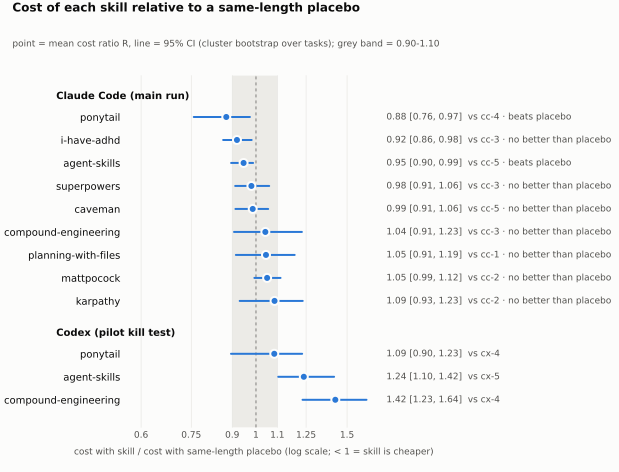

<p align="center">
<picture>
  <source media="(prefers-color-scheme: dark)" srcset="docs/img/forest-dark.svg">
  
</picture>
</p>

# skill-placebo

**A placebo-controlled test of the most-starred skills for coding agents: does a skill do better than the same amount of neutral text?**

> Drug trials give the control group a sugar pill. We gave coding agents one: neutral instructions of the same length, installed the same way as each skill.

**2 of 9 skills beat a same-length placebo, both at Holm-adjusted p = 0.049 (0 worse, 7 no better).** Control: a same-length neutral placebo, installed like the skill.<br>
Secondary, against no skill: none of the 9 skills was measurably cheaper than running without a skill; a same-length placebo alone changed cost by +2% to +16%.<br>
<sub>Measured 2026-09-30 on 15 public tasks (SWE-bench Verified, Terminal-Bench 2.1, OpenThoughts-TBLite) with claude-opus-5-5 in Claude Code, 30 trials per arm, 450 trials in total. Method registered before the first run: [METHOD.md](METHOD.md). Per-trial records: [`results/`](results/); the agents' full logs: [release v0.1.0](https://github.com/simonether/skill-placebo/releases/tag/v0.1.0) (sha256 in `results/*/*/AGENT_LOGS.json`). Reproduce a row: `git clone https://github.com/simonether/skill-placebo && cd skill-placebo && uv run skill-placebo run <owner/repo>`.</sub>

## Results: Claude Code (claude-opus-5-5)

| Skill | Cost vs placebo R [95% CI] | Change | Pass skill / placebo | D, pp [95% CI] | Verdict | n |
|---|---|---:|---|---|---|---|
| superpowers | 0.98 [0.91, 1.06] | −2% | 83% / 87% | −3 [−10, +0] | no better than placebo | 30/30 |
| mattpocock | 1.05 [0.99, 1.12] | +5% | 83% / 87% | −3 [−10, +0] | no better than placebo | 30/30 |
| karpathy | 1.09 [0.93, 1.23] | +9% | 83% / 87% | −3 [−13, +7] | no better than placebo | 30/30 |
| ponytail | 0.88 [0.76, 0.97] | −12% | 90% / 87% | +3 [−7, +13] | beats placebo | 30/30 |
| caveman | 0.99 [0.91, 1.06] | −1% | 90% / 87% | +3 [+0, +10] | no better than placebo | 30/30 |
| agent-skills | 0.95 [0.90, 0.99] | −5% | 83% / 87% | −3 [−10, +0] | beats placebo | 30/30 |
| i-have-adhd | 0.92 [0.86, 0.98] | −8% | 87% / 87% | +0 [−10, +10] | no better than placebo | 30/30 |
| planning-with-files | 1.05 [0.91, 1.19] | +5% | 83% / 100% | −17 [−33, −3] | no better than placebo | 30/30 |
| compound-engineering | 1.04 [0.91, 1.23] | +4% | 87% / 87% | +0 [−10, +10] | no better than placebo | 30/30 |

CIs are unadjusted; verdicts use Holm-adjusted p across 9 skills (i-have-adhd: cost CI excludes 1, Holm-adjusted p = 0.095; planning-with-files: pass-rate CI excludes 0, Holm-adjusted p = 0.178).

R is the skill's mean cost divided by its placebo's; below 1 the skill is cheaper. D is the pass-rate
difference. Verdicts follow [METHOD.md 9.1](METHOD.md#91-verdict-per-skill-and-harness), with Holm
correction across the 9 skills. D stays out of the headline: with this many trials its 95% CI is about ±10 points, too wide to rank skills by. This is v1: 30 trials per arm
([METHOD.md, amendments 16-17](METHOD.md)); more runs come as updates.

## Codex (gpt-6-sol): pilot only, secondary

| Skill | Cost vs placebo R [95% CI] | Change | Pass skill / placebo | D, pp [95% CI] | Verdict | n |
|---|---|---:|---|---|---|---|
| ponytail | 1.09 [0.90, 1.23] | +9% | 90% / 100% | −10 [−30, +0] | no better than placebo | 10/10 |
| agent-skills | 1.24 [1.10, 1.42] | +24% | 100% / 80% | +20 [+0, +60] | worse than placebo | 10/10 |
| compound-engineering | 1.42 [1.23, 1.64] | +42% | 100% / 100% | +0 [+0, +0] | worse than placebo | 10/10 |

These are the pilot's kill test on Codex: 3 skills on 5 tasks, 10 trials per arm.
The Codex main run did not take place for v1 ([METHOD.md, amendment 17](METHOD.md)); it may come as an update.

## What the READMEs claim, and what we measured

| Skill | Claimed (quote, source) | Their setup | Our closest measure | Measured |
|---|---|---|---|---|
| superpowers | no numeric claim in README at [`8ca22db`](https://github.com/obra/superpowers/tree/8ca22dba9a94f28898bbce59f2537ff4d87c747d) | | | verdict only |
| mattpocock | no numeric claim in README at [`c55ee46`](https://github.com/mattpocock/skills/tree/c55ee46073ed923f86ce59a5eb3b6d895095d1b7) | | | verdict only |
| karpathy | no numeric claim in README at [`2c60614`](https://github.com/multica-ai/andrej-karpathy-skills/tree/2c606141936f1eeef17fa3043a72095b4765b9c2) | | | verdict only |
| ponytail | ~54% less code ([README.md:33](https://github.com/DietrichGebert/ponytail/blob/e3ba2aa6f1e6f0bc4d69eb09c9f0d0a93af56156/README.md#L33)) | mean over 12 feature tasks, Haiku 4.5, n=4, vs the same agent with no skill (README.md:34) | final diff size vs baseline: lines added + deleted + untracked, SWE-bench tasks only, trials after the measure was switched on (METHOD.md amendment 12a) | −13%, 95% CI [−27%, +12%]; n = 11 / 10 trials on 7 tasks (few trials: read with care) |
| ponytail | ~20% cheaper ([README.md:33](https://github.com/DietrichGebert/ponytail/blob/e3ba2aa6f1e6f0bc4d69eb09c9f0d0a93af56156/README.md#L33)) | mean over 12 feature tasks, Haiku 4.5, n=4, vs the same agent with no skill (README.md:34) | cost vs baseline (and vs placebo) | −1%, 95% CI [−19%, +13%]; n = 30 / 30 trials on 15 tasks |
| ponytail | ~27% faster ([README.md:33](https://github.com/DietrichGebert/ponytail/blob/e3ba2aa6f1e6f0bc4d69eb09c9f0d0a93af56156/README.md#L33)) | mean over 12 feature tasks, Haiku 4.5, n=4, vs the same agent with no skill (README.md:34) | agent wall time vs baseline | −11%, 95% CI [−30%, +13%]; n = 30 / 30 trials on 15 tasks |
| ponytail | -22% tokens ([README.md:85](https://github.com/DietrichGebert/ponytail/blob/e3ba2aa6f1e6f0bc4d69eb09c9f0d0a93af56156/README.md#L85)) | same benchmark; the -22% column is tokens | total tokens vs baseline | +4%, 95% CI [−11%, +18%]; n = 30 / 30 trials on 15 tasks |
| caveman | 65% fewer tokens (talking like a caveman: the agent's output) ([GitHub repository description](https://github.com/JuliusBrussee/caveman)) | repository description, read with gh api on 2026-09-30 | output tokens vs baseline (comparable to the claim) | −2%, 95% CI [−9%, +6%]; n = 30 / 30 trials on 15 tasks |
| caveman | 65% fewer tokens ([GitHub repository description](https://github.com/JuliusBrussee/caveman)) | repository description, read with gh api on 2026-09-30 | total tokens vs baseline (input and cache included; not the claim's metric) | +18%, 95% CI [+8%, +28%]; n = 30 / 30 trials on 15 tasks |
| caveman | 65% fewer tokens ([GitHub repository description](https://github.com/JuliusBrussee/caveman)) | repository description, read with gh api on 2026-09-30 | cost vs baseline (not the claim's metric) | +14%, 95% CI [+8%, +21%]; n = 30 / 30 trials on 15 tasks |
| caveman | -50% output tokens vs a terse control ([README.md:206](https://github.com/JuliusBrussee/caveman/blob/2fd153c67988e980fb0b2455c90832159a6a5a25/README.md#L206)) | ten dev questions, skill vs a plain 'Answer concisely.' control, claude-opus-4-6 | output tokens vs placebo (our placebo is neutral, not terse) | −5%, 95% CI [−14%, +3%] |
| agent-skills | no numeric claim in README at [`2686b62`](https://github.com/addyosmani/agent-skills/tree/2686b620fc1fed2e8f60c704839c766b8594c6b6) | | | verdict only |
| i-have-adhd | no numeric claim in README at [`839872f`](https://github.com/ayghri/i-have-adhd/tree/839872f9d1cd634fed642b4589ce7226199cc15f) | | | verdict only |
| planning-with-files | 96.7% assertion pass rate ([README.md:33](https://github.com/OthmanAdi/planning-with-files/blob/51c1caa27f9fefe259e45a7cc92fa79ee8787cd7/README.md#L33)) | v2.21.0 eval on claude-sonnet-4-6, 30 assertions of file-pattern fidelity, not task success (README.md:702) | not comparable: our pass is the task's own tests; pass rate vs baseline and placebo is shown | 83% vs 87% without the skill, D −3 [−13, +7] pp |
| planning-with-files | 13.3 → 5.0 turns after a context wipe ([README.md:75](https://github.com/OthmanAdi/planning-with-files/blob/51c1caa27f9fefe259e45a7cc92fa79ee8787cd7/README.md#L75)) | turns to resume after a context wipe, internal benchmark v1 | not measured: single-session tasks, no context wipe (METHOD.md section 13) | not measured by this design |
| compound-engineering | no numeric claim in README at [`e80c5c4`](https://github.com/EveryInc/compound-engineering-plugin/tree/e80c5c40440b90672d78f032f6dfaedc0daeb292) | | | verdict only |

The claims were measured by their authors on other tasks, models and baselines (the "their setup"
column), so a gap between the two columns does not mean the claim was wrong. It shows how much the
number changes in a different setup.

## How it works

- Every skill runs in three arms on the same tasks: no skill, placebo, skill.
- The placebo is neutral text sized to the skill's always-on token footprint (within ±10%, measured),
  delivered through the same mechanism: plugin, hook or memory file ([METHOD.md 4.1](METHOD.md#41-placebo-construction)).
- Cost is recorded tokens times public list prices: an estimate by tokens, not an invoice. The 95% CIs come from a cluster bootstrap over tasks.
- Skills are installed as their authors document, at a pinned commit ([skills.lock.json](skills.lock.json)).
  Every trial is published, including the failed and interrupted ones.

## For skill authors

If your skill was installed wrong or its placebo is unfair to it, [open an issue](https://github.com/simonether/skill-placebo/issues/new?template=skill-install-dispute.yml): skill, commit, what is
wrong, how to check. Every trial is public, so you can point at the exact runs. A confirmed installation error
means your skill's arms are rerun in full, the result is updated, an amendment in METHOD.md records it, and the
issue is linked here ([METHOD.md, amendment 19](METHOD.md)).

## Reproduce

```bash
git clone https://github.com/simonether/skill-placebo && cd skill-placebo && uv run skill-placebo run DietrichGebert/ponytail   # one skill: baseline, placebo, skill on the same tasks
```

## Limits

- Two models at medium effort, each harness's default: claude-opus-5-5 (Claude Code) and gpt-6-sol (Codex). Other models
  can behave differently.
- The tasks are public and probably in the models' training data. That affects every arm equally, but
  absolute pass rates say little about new work.
- Most tasks sat at the ceiling for claude-opus-5-5, so the pass rate carries little information here and
  the headline is cost.
- Tasks take minutes. Skills that pay off over long sessions (memory, multi-day plans) are not measured.

## Port me

- [ ] Run a skill on OpenCode or Gemini CLI (`good first issue`)
- [ ] Propose a skill: open an issue with the repository
- [ ] Rerun on fresh tasks (a recent SWE-rebench slice)

## License

MIT, see [LICENSE](LICENSE).

## Badge for tested skills

`[](https://github.com/simonether/skill-placebo#results-claude-code)`

---
<sub>Made by Simon (@simonether) · I take AI-built apps from demo to production at Keelfast.</sub>
